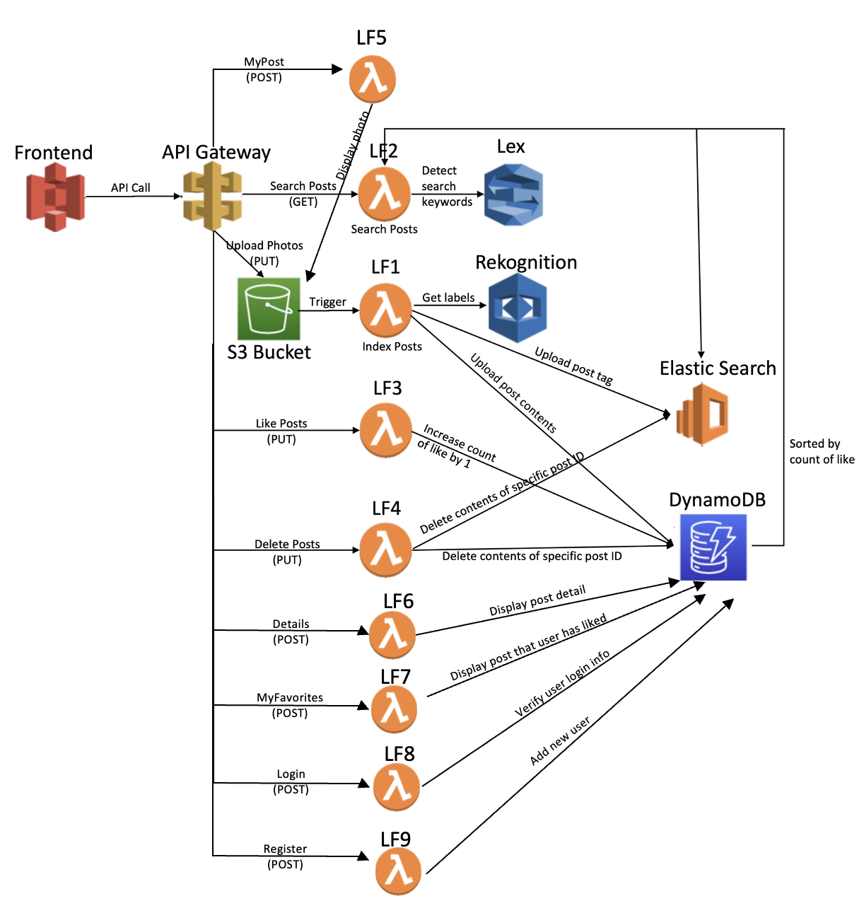
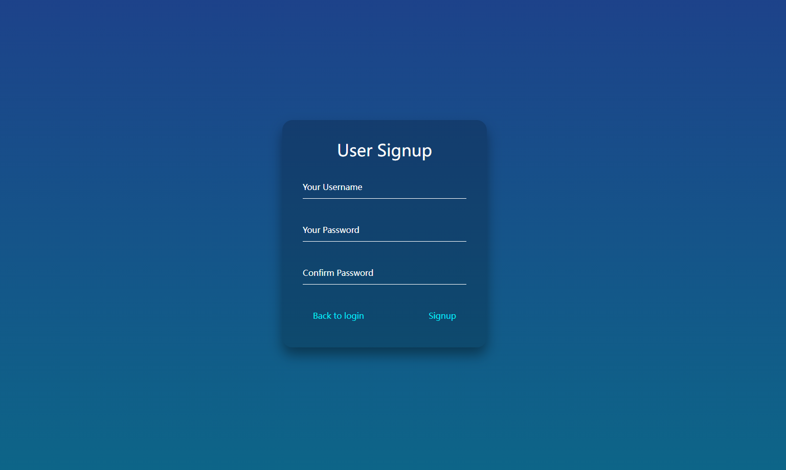
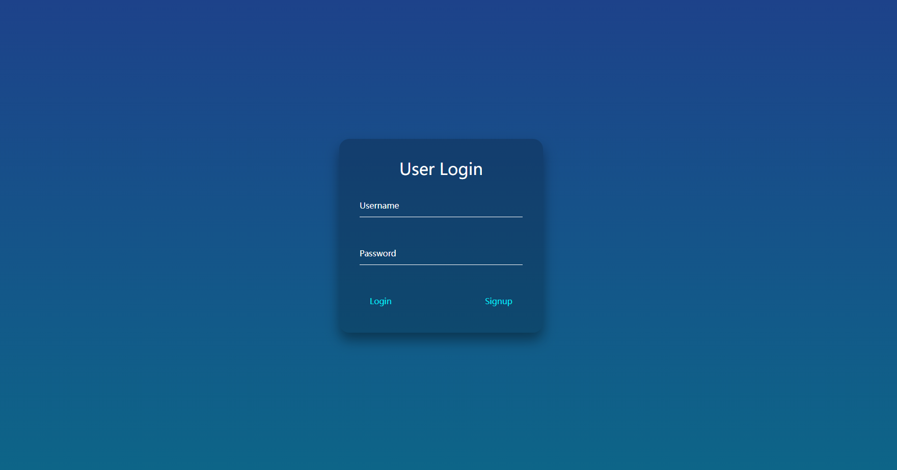
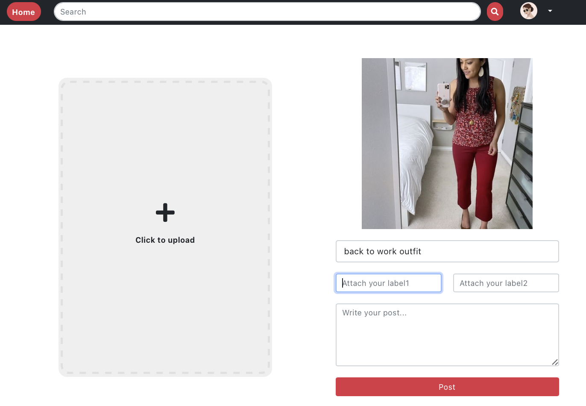
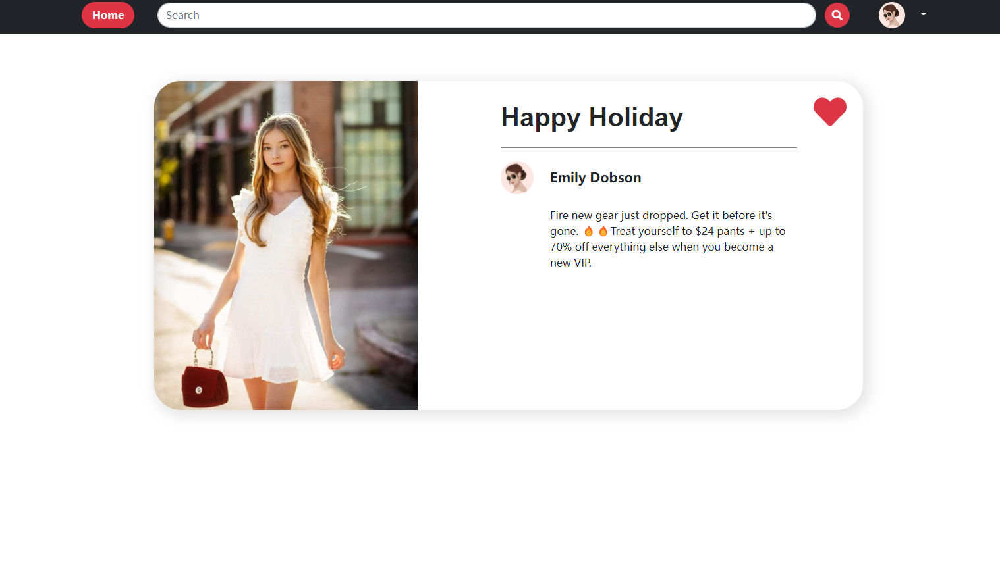
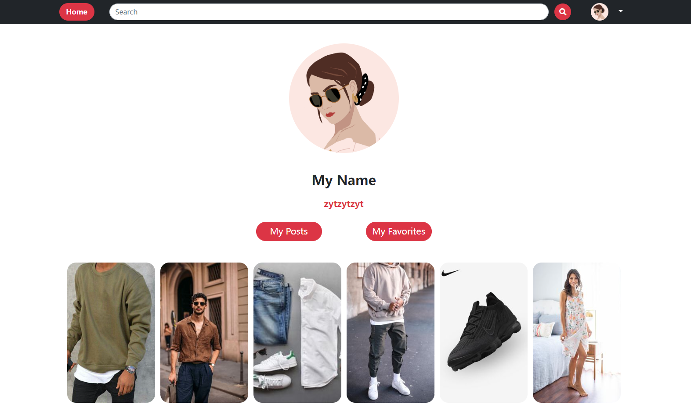

# Outfit Posting Web Application on AWS
## Cloud Computing Project, Spring 2022

[]()


The repository contains source codes of the cloud computing project for creating an Outfit Posting Platform Web Application.

The source codes includes:

1. Data Collections
2. Frontend - Interfaces of user experience
3. Backend - 10 Lambda functions of the web application

## Table of Contents

- [Background](#background)
- [Architecture](#architecture)
- [Interfaces](#interfaces)
- [Install](#install)

## Background

Outfit posting platform web application that can post and search photos using natural language through text on AWS. The web application consists of 10 functions for user experience, and each function is implemented in a Lambda function. 

The backend of the application uses Lex, Rekognition, and ElasticSearch to create an intelligent search layer for users to query photos of outfits based on their preferences. And databases such as S3 bucket and DynamoDB are used to store the detail of posts. 

The frontend of the application provides users with responsive interfaces via UI design by using JavaScript, HTML, and CSS. The front-end is hosted on the AWS S3 bucket and connects to the back-end through API Gateway. 

**10 functions of the web application**
>1. Register - sign up an account
>2. Login - login to user interface
>3. Search - search photos based on input text
>4. Recommendation - recommend photos based on user preference 
>5. Post - post photos of outfits
>6. Like - like the post
>7. Detail - view details of the post
>8. Delete - delete the previous post
>9. Mypost - view user previous posts
>10. Myfavorite - view posts that user liked before


## Architecture



## Interfaces

### Register

### Login

### Search & Recommendation

### Post

### Like & Detail

### Delete & Mypost & Myfavorite



## Install

Cloning the repository and installing its dependencies:

```sh
git clone https://github.com/TiffanyLiu1/Outfit-Posting-Web-Application.git
cd Outfit-Posting-Web-Application
cd frontend
cd photo-sharing-platform
npm install
npm start
```


